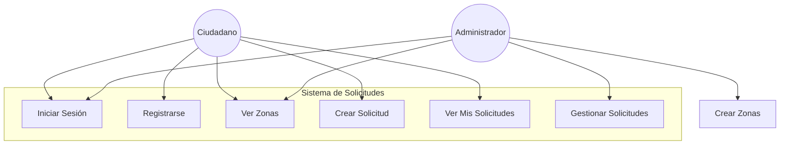
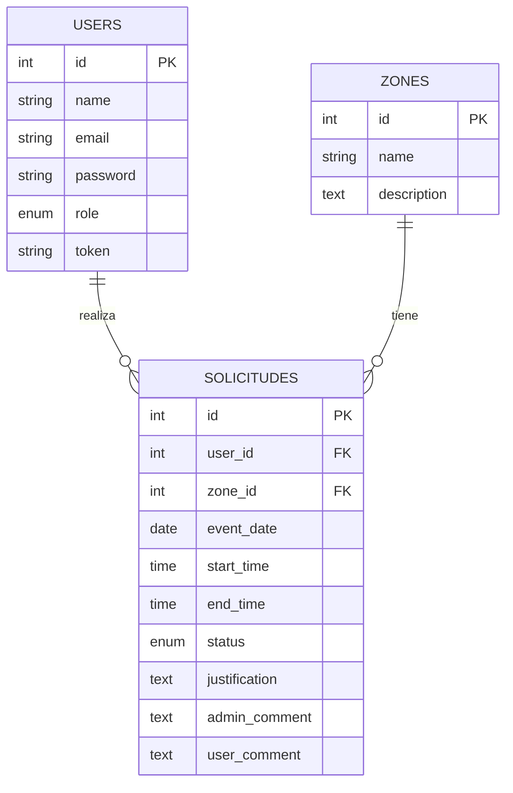
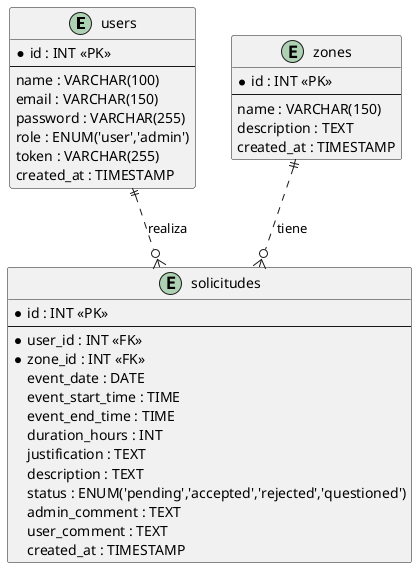
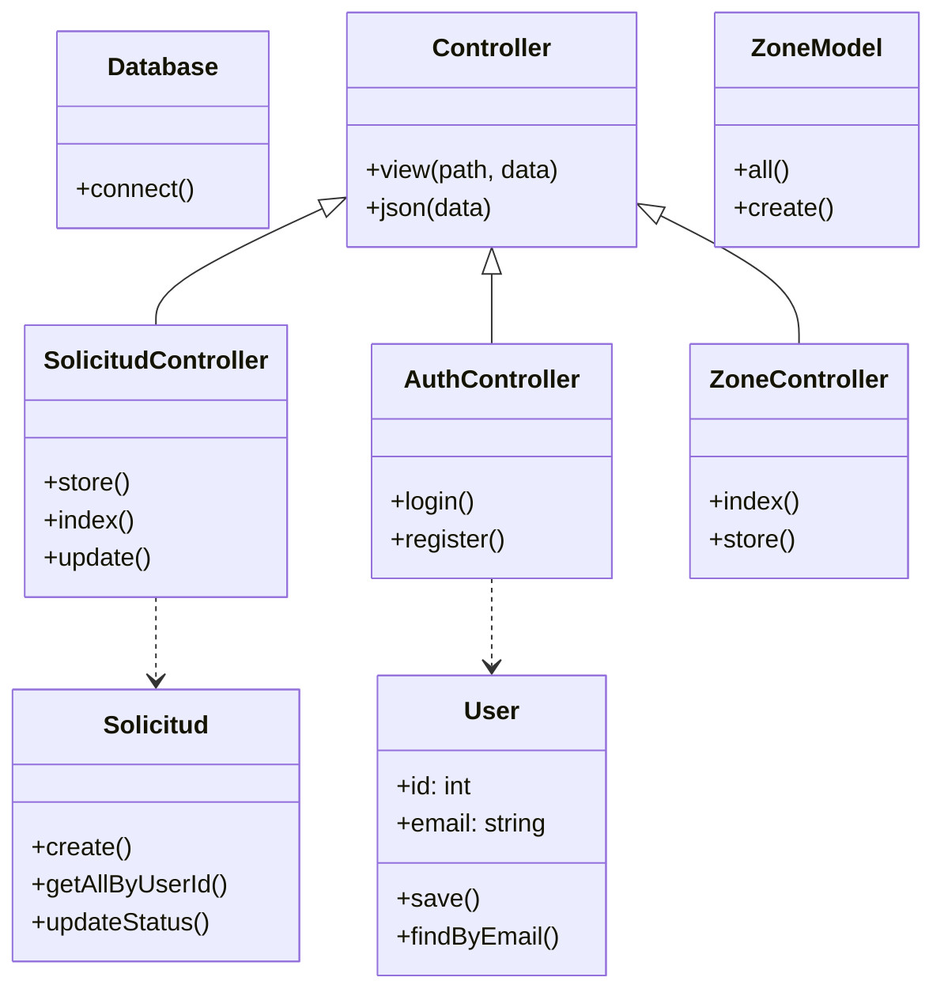
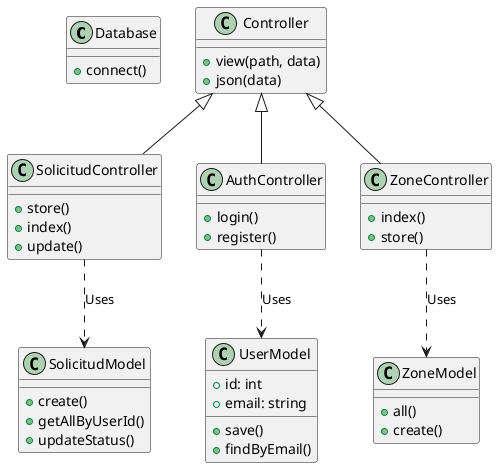
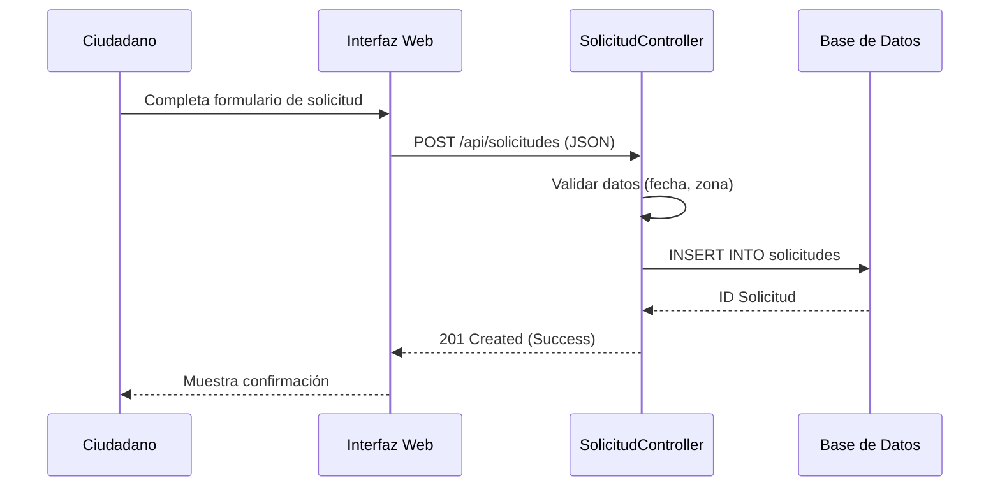

# Documentación del Proyecto: Sistema de Solicitudes de Espacios Públicos

## 1. Descripción General

### 1.1 Resumen del Proyecto
El "Sistema de Solicitudes de Espacios Públicos" es una plataforma web desarrollada para gestionar y digitalizar el proceso de reserva y uso de áreas comunes municipales. El sistema permite a los ciudadanos realizar solicitudes de eventos y a la administración pública evaluarlas de manera eficiente.

#### 1.1.1 Propósito, Alcance y Objetivos
- **Propósito**: Modernizar y agilizar la gestión de espacios públicos, eliminando la burocracia en papel y centralizando la información.
- **Alcance**:
    - **Módulo Ciudadano**: Registro, visualización de zonas, calendario de disponibilidad, creación de solicitudes.
    - **Módulo Administrador**: Gestión de usuarios check-in/out de solicitudes, aprobación/rechazo, reportes.
- **Objetivos**:
    1. Reducir el tiempo de respuesta a solicitudes en un 50%.
    2. Garantizar la transparencia en la asignación de espacios.
    3. Proveer una plataforma accesible 24/7.

#### 1.1.3 Elementos del Proyecto Sujetos a Entrega
1. **Código Fuente**: Aplicación web completa (Frontend + Backend PHP).
2. **Base de Datos**: Scripts SQL de creación (DDL) y datos iniciales (DML).
3. **Documentación**: Manual técnico y de usuario (este documento).

#### 1.1.4 Materiales de Consulta
- Manual de PHP 7.4+
- Documentación oficial de MySQL 5.7+
- Estándares de diseño web responsivo (W3C).

---

## 2. Descripción del Dominio

### Planteamiento del Problema
Actualmente, la solicitud de espacios públicos se realiza mediante formularios físicos presenciales, lo que conlleva pérdida de documentos, lentitud en la aprobación y falta de visibilidad para el ciudadano sobre la disponibilidad de los espacios.

### Misión y Visión
- **Misión**: Proveer herramientas tecnológicas que acerquen al ciudadano a la administración pública, facilitando el uso responsable de los bienes comunes.
- **Visión**: Lograr una gestión de espacios públicos 100% digital, transparente y eficiente para el año 2026.

---

## 3. Análisis

### Verbos, Sustantivos y Expresiones Nominales

#### Verbos (Acciones del Sistema)
- **Solicitar**: Acción principal del ciudadano para pedir un espacio.
- **Gestionar**: Acción del administrador para administrar recursos y peticiones.
- **Registrarse**: Crear una cuenta nueva.
- **Autenticar**: Verificar identidad (Login).
- **Aprobar / Rechazar / Cuestionar**: Acciones de decisión sobre una solicitud.
- **Visualizar**: Ver disponibilidad y listas de zonas.

#### Sustantivos (Entidades)
- **Ciudadano/Usuario**: Persona que usa el sistema.
- **Administrador**: Encargado de la gestión.
- **Espacio Público / Zona**: Lugar físico sujeto a reserva (Parque, Plaza).
- **Solicitud**: Petición formal de uso.
- **Calendario**: Representación temporal de la disponibilidad.

#### Expresiones Nominales
- **Sistema de Solicitudes**: El software en su conjunto.
- **Panel de Administración**: Área restringida para gestores.
- **Disponibilidad de Horario**: Estado libre de una zona en una fecha.
- **Justificación de Uso**: Motivo por el cual se solicita el espacio.

### Necesidades

El desarrollo del sistema surge para dar solución a las siguientes necesidades críticas de la administración y la ciudadanía:

1.  **Digitalización de Procesos**: Abandonar el uso de papel para reducir costos, evitar pérdidas de documentos y acelerar el flujo de información.
2.  **Centralización de la Información**: Contar con una base de datos única y confiable donde se registren todas las zonas y solicitudes, evitando la dispersión de datos.
3.  **Transparencia y Accesibilidad**: Permitir que cualquier ciudadano, desde cualquier lugar, pueda consultar la disponibilidad de los espacios sin necesidad de acudir a oficinas gubernamentales.
4.  **Optimización de Tiempos**: Reducir el tiempo de espera entre la solicitud y la resolución por parte de la administración.
5.  **Control y Auditoría**: Facilitar el seguimiento de quién usa qué espacio y cuándo, permitiendo una mejor fiscalización del uso de bienes públicos.

### Requerimientos

El sistema debe cumplir con los siguientes lineamientos generales para garantizar su operatividad y aceptación:

1.  **Soporte Multi-rol**: Debe diferenciar claramente entre las funciones de ciudadanos y administradores.
2.  **Escalabilidad**: La arquitectura debe permitir agregar nuevas zonas sin modificar el código fuente (soportado mediante gestión de base de datos).
3.  **Integridad de Datos**: No se deben permitir solapamientos de reservas en la misma zona y hora.
4.  **Auditabilidad**: Todas las acciones de cambio de estado en las solicitudes deben quedar registradas con el comentario correspondiente.

### Requisitos Funcionales y No Funcionales

#### Requisitos Funcionales
1. **RF01 - Autenticación**: El sistema debe permitir registro y login de usuarios y administradores.
2. **RF02 - Gestión de Zonas**: El sistema debe listar las zonas disponibles (Parques, Plazas).
3. **RF03 - Solicitud**: El usuario debe poder crear una solicitud especificando zona, fecha, hora y justificación.
4. **RF04 - Gestión de Solicitudes**: El administrador debe poder aprobar, rechazar o cuestionar solicitudes.
5. **RF05 - Historial**: El usuario debe verificar el estado de sus solicitudes.
6. **RF06 - Gestión de Zonas**: El administrador debe poder crear nuevas zonas en el sistema.
7. **RF07 - Disponibilidad**: El usuario debe poder visualizar las fechas no disponibles en el calendario al seleccionar una zona.

#### Requisitos No Funcionales
1. **RNF01 - Seguridad**: Las contraseñas deben estar encriptadas (bcrypt/hash).
2. **RNF02 - Disponibilidad**: El sistema debe estar disponible 99.9% del tiempo.
3. **RNF03 - Interfaz**: Diseño responsivo y amigable (UX/UI).

### Glosario
- **API (Application Programming Interface)**: Conjunto de definiciones y protocolos que se utiliza para desarrollar e integrar el software de las aplicaciones.
- **Backend**: Parte del desarrollo web que se encarga de que toda la lógica de una página web funcione.
- **Frontend**: Parte del sitio web con la que el usuario interactúa.
- **MVC (Modelo-Vista-Controlador)**: Patrón de arquitectura de software que separa los datos y la lógica de negocio de la interfaz de usuario.
- **Token**: Cadena de caracteres que sirve como credencial de acceso para validar la sesión de un usuario.
- **XAMPP**: Paquete de software libre que consiste principalmente en el sistema de gestión de bases de datos MySQL, el servidor web Apache y los intérpretes para lenguajes de script PHP y Perl.
- **Zona**: Área delimitada dentro de un espacio público disponible para ser reservada (ej. un kiosco en un parque).

### Modelo del Dominio y Actores

**Modelo Conceptual del Dominio (Estructura de Entidades)**:

1.  **Entidad: Usuario (Ciudadano y Administrador)**
    *   **Atributos**: Nombre, Email, Contraseña, Rol.
    *   **Responsabilidades**:
        *   *Ciudadano*: Iniciar sesión, buscar zonas, realizar solicitudes, consultar historial.
        *   *Administrador*: Gestionar zonas (crear/editar), moderar solicitudes (aceptar/rechazar/cuestionar).

2.  **Entidad: Zona (Espacio Público)**
    *   **Atributos**: ID, Nombre, Descripción, Fecha de creación.
    *   **Relaciones**: Es reservada por múltiples Solicitudes.

3.  **Entidad: Solicitud**
    *   **Atributos**: Fecha del evento, Hora inicio/fin, Duración, Justificación, Estado (Pendiente, Aceptada, Rechazada, Cuestionada), Comentarios.
    *   **Relaciones**: Pertenece a un Usuario, está asociada a una Zona.

**Actores**:
1. **Solicitante (Ciudadano)**: Persona que desea reservar un espacio.
2. **Administrador**: Funcionario encargado de validar las reservas.

### Diagramas de Caso de Uso



### Casos de Uso Escritos

#### CU-01: Registrar Usuario
- **Actor**: Ciudadano No Registrado
- **Precondición**: No tener sesión iniciada.
- **Flujo Principal**:
    1. El actor accede a la opción "Registrarse".
    2. El sistema solicita Nombre, Email y Contraseña.
    3. El actor ingresa los datos.
    4. El sistema valida que el email no exista.
    5. El sistema crea el usuario y confirma el registro.
- **Postcondición**: El usuario queda registrado y puede iniciar sesión.

#### CU-02: Crear Solicitud
- **Actor**: Ciudadano Autenticado
- **Precondición**: Estar logueado.
- **Flujo Principal**:
    1. El actor selecciona "Crear Solicitud".
    2. El sistema muestra la lista de zonas.
    3. El actor selecciona una zona.
    4. El sistema muestra la disponibilidad (fechas ocupadas).
    5. El actor ingresa fecha, hora, justificación y descripción.
    6. El sistema guarda la solicitud como "Pendiente".
- **Postcondición**: Nueva solicitud creada visible en el historial.

#### CU-03: Gestionar Solicitud
- **Actor**: Administrador
- **Precondición**: Estar logueado como Admin.
- **Flujo Principal**:
    1. El actor accede al panel administrativo.
    2. El sistema lista todas las solicitudes.
    3. El actor selecciona una solicitud "Pendiente".
    4. El actor revisa los detalles y decide: Aceptar, Rechazar o Cuestionar.
    5. El sistema actualiza el estado y notifica (visualmente) el cambio.
- **Postcondición**: La solicitud cambia de estado.

### Tabla de Votación & Casos de Uso (Resumen)
| Caso de Uso | Actor | Prioridad | Complejidad |
|-------------|-------|-----------|-------------|
| Registrar Usuario | Ciudadano | Alta | Baja |
| Crear Solicitud | Ciudadano | Alta | Media |
| Gestionar Solicitud | Admin | Alta | Media |

### Diagrama de Datos (EE-R) UML



### Código PlantUML (Alternativo)



### Diccionario de Datos
**Tabla: `users`**
- `id`: Identificador único (INT, PK).
- `email`: Correo electrónico único del usuario.
- `role`: Rol del usuario ('user' o 'admin').

**Tabla: `solicitudes`**
- `status`: Estado actual ('pending', 'accepted', 'rejected', 'questioned').
- `duration_hours`: Duración del evento en horas.
- `admin_comment`: Comentarios realizados por el administrador.
- `user_comment`: Respuesta del usuario a las observaciones.

### Script DDL SQL
Ver archivo `db.sql` adjunto en el repositorio.
```sql
CREATE TABLE `solicitudes` (
  `id` INT AUTO_INCREMENT PRIMARY KEY,
  `user_id` INT NOT NULL,
  `zone_id` INT NOT NULL,
  -- ... (ver archivo completo)
);
```

---

## 4. Diseño

### Diagrama de Clases



### Código PlantUML (Clases - Alternativo)



### Arquitectura del Sistema
El sistema utiliza el patrón **MVC (Model-View-Controller)**:
- **Modelo**: Clases en `app/models/` gestionan la lógica de negocio y acceso a datos (`User`, `Solicitud`).
- **Vista**: Archivos HTML/JS en `public/app/` consumen la API JSON (Arquitectura SPA simplificada o Cliente-Servidor desacoplado).
- **Controlador**: Clases en `app/controllers/` procesan la entrada HTTP y retornan JSON (`SolicitudController`).

### Diagrama de Secuencia de Sistema (Crear Solicitud)



---

## 5. Implementación del Sistema

### Estructura del Código
```
/proyecto4
├── app
│   ├── config      # Database config
│   ├── controllers # API Logic
│   ├── models      # Data Access
│   └── core        # Framework base
├── public          # Web Root
│   ├── app         # Frontend Views
│   └── index.php   # Entry point
└── db.sql          # Database Schema
```

### Requerimiento de Instalación
1. Copiar archivos a `c:/xampp/htdocs/proyecto4`.
2. Importar `db.sql` en MySQL `espacio_publico`.
3. Configurar `app/config/database.php`.

### Ambientación y Datos
El script `db.sql` inserta automáticamente las zonas:
- **Zona 1**: Parque Central.
- **Zona 2**: Plaza Cultural.

---

## 6. Conclusión
El Sistema de Solicitudes de Espacios Públicos cumple con los requerimientos de modernización administrativa, proporcionando una arquitectura robusta (MVC) y una base de datos relacional escalable para gestionar las interacciones entre ciudadanos y la administración pública de manera segura y eficiente.
